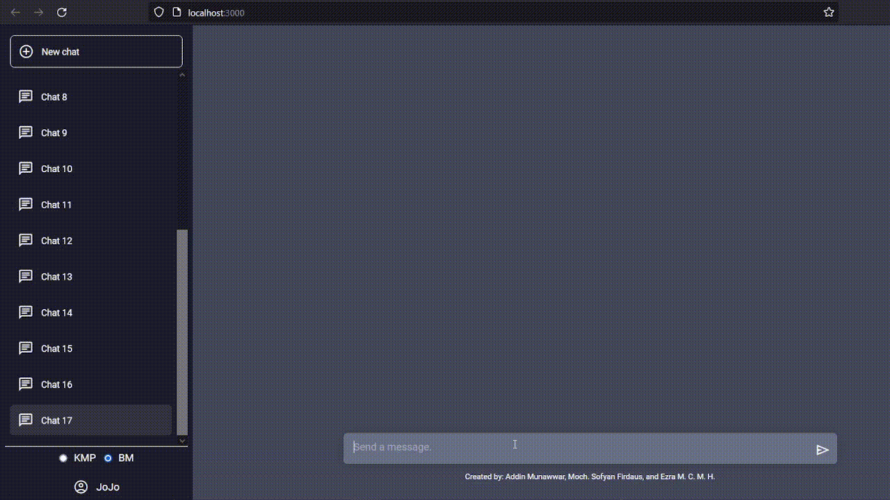

# Tubes3_gpt-chan~ (〃▽〃)
<!-- PROJECT LOGO -->
<br />
<div align="center">
  <p align="center">
⣿⣿⣿⣿⣿⣿⣿⣿⣿⣿⣿⣿⣿⣿⣿⣿⣿⣿⣿⣿⣷⣬⡛⣿⣿⣿⣯⢻ <br />
⣿⣿⣿⣿⣿⣿⣿⣿⣿⣿⣿⡟⢻⣿⣿⢟⣻⣿⣿⣿⣿⣿⣿⣮⡻⣿⣿⣧ <br />
⣿⣿⣿⣿⣿⢻⣿⣿⣿⣿⣿⣿⣆⠻⡫⣢⠿⣿⣿⣿⣿⣿⣿⣿⣷⣜⢻⣿ <br />
⣿⣿⡏⣿⣿⣨⣝⠿⣿⣿⣿⣿⣿⢕⠸⣛⣩⣥⣄⣩⢝⣛⡿⠿⣿⣿⣆⢝ <br />
⣿⣿⢡⣸⣿⣏⣿⣿⣶⣯⣙⠫⢺⣿⣷⡈⣿⣿⣿⣿⡿⠿⢿⣟⣒⣋⣙⠊ <br />
⣿⡏⡿⣛⣍⢿⣮⣿⣿⣿⣿⣿⣿⣿⣶⣶⣶⣶⣾⣿⣿⣿⣿⣿⣿⣿⣿⣿ <br />
⣿⢱⣾⣿⣿⣿⣝⡮⡻⣿⣿⣿⣿⣿⣿⣿⣿⣿⣿⡿⠿⠛⣋⣻⣿⣿⣿⣿ <br />
⢿⢸⣿⣿⣿⣿⣿⣿⣷⣽⣿⣿⣿⣿⣿⣿⣿⡕⣡⣴⣶⣿⣿⣿⡟⣿⣿⣿ <br />
⣦⡸⣿⣿⣿⣿⣿⣿⡛⢿⣿⣿⣿⣿⣿⣿⣿⣿⣿⣿⣿⣿⣿⣿⡇⣿⣿⣿ <br />
⢛⠷⡹⣿⠋⣉⣠⣤⣶⣶⣿⣿⣿⣿⣿⣿⡿⠿⢿⣿⣿⣿⣿⣿⣷⢹⣿⣿ <br />
⣷⡝⣿⡞⣿⣿⣿⣿⣿⣿⣿⣿⡟⠋⠁⣠⣤⣤⣦⣽⣿⣿⣿⡿⠋⠘⣿⣿ <br />
⣿⣿⡹⣿⡼⣿⣿⣿⣿⣿⣿⣿⣧⡰⣿⣿⣿⣿⣿⣹⡿⠟⠉⡀⠄⠄⢿⣿ <br />
⣿⣿⣿⣽⣿⣼⣛⠿⠿⣿⣿⣿⣿⣿⣯⣿⠿⢟⣻⡽⢚⣤⡞⠄⠄⠄⢸⣿ <br />
  
  </p>
  <h3 align="center">GPT-CHAN (*≧▽≦)🚩 </h3>

  <p align="center">
     GPT-Chan adalah program Chatbot AI yang berbasiskan algrotima string matching, yaitu Knuth-Morris-Pratt (KMP) dan Boyer-Moore (BM), dan juga Regex. Aplikasi ini dibuat untuk memenuhi Tugas Besar 3 Strategi Algoritma IF2211, Teknik Informatika Institut Teknologi Bandung
  </p>
</div>

## Little Demo


## Technology Used
1. [SolidJS](https://www.solidjs.com/) for frontend
2. [Golang](https://go.dev/) for backend
3. [PostgreSQL](https://www.postgresql.org/) for database
4. [Google Cloud Platform](https://cloud.google.com/) for backend and database deployment
5. [Docker](https://www.docker.com/) for containerization

## Prerequisite
1. Install [Node.JS](https://nodejs.org/en)

## How to Run the App
1. Clone repository ini dengan command berikut ini
```
https://github.com/moonawar/Tubes3_gpt-chan.git
```
2. Masuk ke dalam folder repository yang sudah di clone
3. Jalankan command `cd frontend` untuk masuk ke folder frontend
4. Jalankan command `npm run dev`. Jika berjalan dengan baik, maka command line akan merespon dengan pesan link localhost yang terbuka. Secara default, localhost akan menggunakan port http://localhost:3000/.
5. Ctrl-Left-click untuk membuka link tersebut atau masukkan url tersebut pada browser.
6. Wallaa, aplikasi sudah dapat digunakan:D

## Made By
| Name                           |   Nim    |
| ------------------------------ | :------: |
| Ezra Maringan Christian Mastra Hutagaol   | 13521073 |
| Moch. Sofyan Firdaus            | 13521083 |
| Addin Munawwar Yusuf           | 13521085 |
